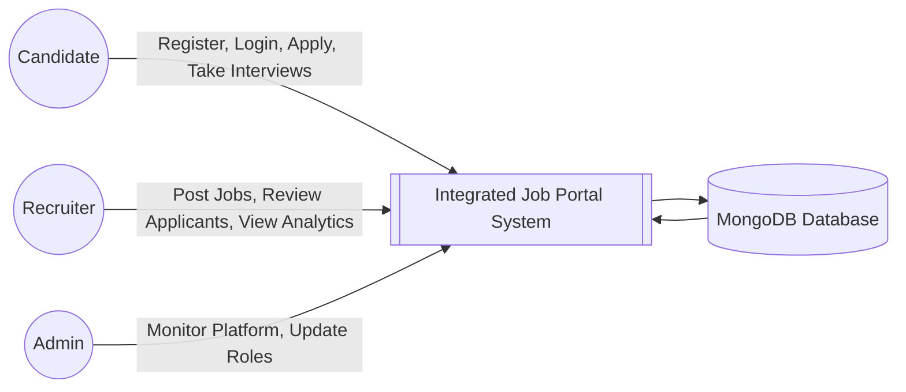
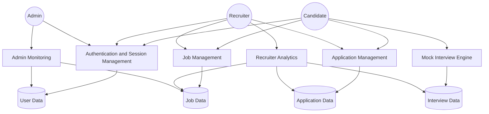
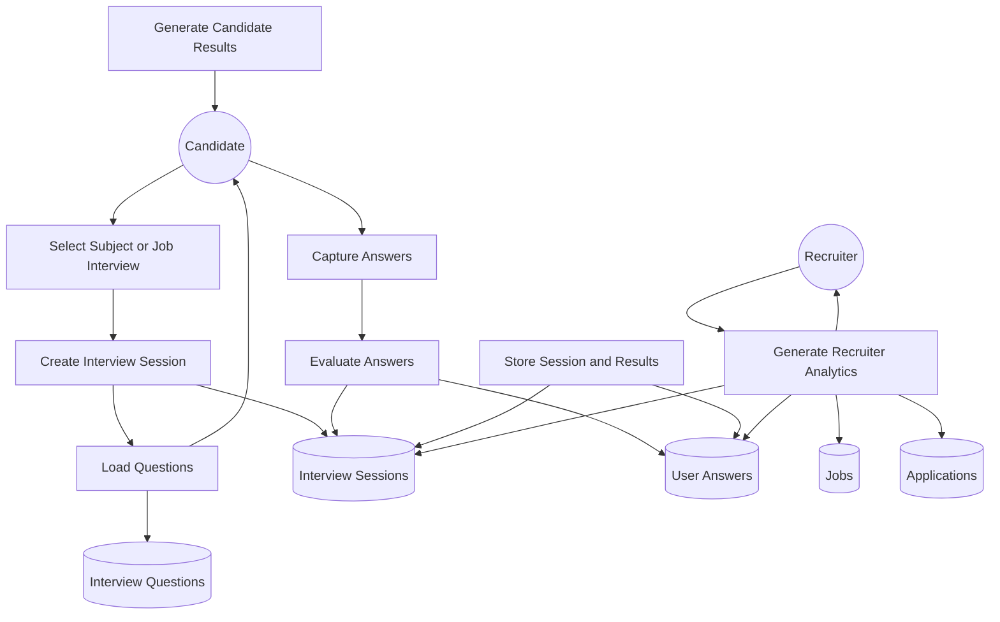

# A Full-Stack Job Portal with Mock Interview Assessment, Recruiter Analytics, and Role-Based Candidate Management

## Author Details

### Author 1
**Full Name:** Prince Kumar Giri  
**Mobile Number:** +91 6299430711  
**Email:** princekumargiri4378@gmail.com  
**UID / Registration Number:** 12312067  
**Affiliation Address:** Lovely Professional University, Punjab 144411, India  

### Author 2
**Full Name:** Dhariya Jalota  
**Mobile Number:** +91 9573687736  
**Email:** dhariyajalota@gmail.com  
**UID / Registration Number:** 12309587  
**Affiliation Address:** Lovely Professional University, Punjab 144411, India  

### Author 3
**Full Name:** Ravi Vardhan  
**Mobile Number:** +91 9573687736  
**Email:** mrvarma3110@gmail.com  
**UID / Registration Number:** 12315984  
**Affiliation Address:** Lovely Professional University, Punjab 144411, India  

## Abstract
Modern recruitment systems often separate job discovery from interview preparation, resulting in fragmented workflows for both candidates and recruiters. Existing portals usually support job search and application tracking but do not provide integrated candidate assessment, recruiter-side analytics, or interview-readiness support within the same platform. This work presents a full-stack Job Portal with an integrated Mock Interview and Recruiter Analytics System developed using the MERN stack: MongoDB, Express.js, React.js, and Node.js. The platform supports three roles: candidate, recruiter, and administrator. Candidates can register, manage profiles, upload resumes, browse jobs, apply to jobs, and take subject-based mock interviews. Recruiters can post jobs, manage applications, create custom interview templates for jobs, and analyze both job-specific interview outcomes and normal mock interview performance of applicants. Administrators can monitor users, recruiters, and platform-wide activity. The proposed system also includes browser-side interview proctoring using face detection, audio monitoring, and tab-switch tracking, along with automated answer scoring and structured feedback generation. The project demonstrates how a single role-aware web platform can combine hiring workflow management with interview preparation and recruiter decision support.

**Keywords:** Job Portal, MERN Stack, Mock Interview, Recruiter Analytics, Role-Based Access Control, Resume Upload, Proctoring, Candidate Assessment, Full-Stack Web Application

## 1. Introduction
Digital recruitment has become a central part of employability and talent acquisition. Candidates require accessible platforms where they can discover opportunities, apply efficiently, and improve interview readiness. Recruiters require systems that not only collect applications but also help compare and shortlist candidates meaningfully. Conventional job portals address only a part of this process, mainly job posting and application handling. They generally do not integrate interview preparation, behavioral monitoring, subject-based evaluation, or recruiter analytics in a unified architecture.

The project described in this report addresses that gap through a full-stack recruitment platform that integrates:

1. job discovery and application management,
2. profile and resume handling,
3. subject-based mock interview practice,
4. recruiter-defined job-specific interview templates,
5. recruiter-facing analytics for decision support,
6. administrative monitoring and role control.

The resulting system is not merely a CRUD-based portal but an end-to-end recruitment support environment.

## 2. Problem Statement
Current job portals typically suffer from one or more of the following limitations:

1. They allow job browsing and application submission but provide no structured interview practice.
2. They offer no integrated method for recruiters to compare candidate readiness using interview signals.
3. They do not connect applicant records with assessment performance in a role-specific and recruiter-specific manner.
4. They provide weak support for practical interview monitoring and candidate authenticity during online assessments.
5. They separate candidate preparation tools from recruiter evaluation tools, causing workflow fragmentation.

Therefore, the research problem addressed in this work is:

**How can a web-based recruitment platform integrate job application workflow, candidate interview preparation, recruiter-defined assessments, and recruiter analytics into one secure, role-aware, full-stack system?**

## 3. Problem Domain Match
This project aligns with the following academic and practical problem domains:

### 3.1 Primary Problem Domain
**Smart Hiring and Assessment Systems**

The project directly belongs to the domain of intelligent hiring support systems because it combines:
- candidate application workflow,
- interview preparedness support,
- automated answer evaluation,
- recruiter analytics for shortlisting.

### 3.2 Secondary Problem Domains
- **E-Recruitment Systems**
- **Computer-Assisted Assessment Systems**
- **Educational Technology for Interview Preparation**
- **Human Resource Decision Support Systems**
- **Role-Based Secure Web Information Systems**

### 3.3 Recommended Problem Statement Category for Publication or Project Submission
If you need to map this project into a cleaner publication theme, the best match is:

**“A Smart Recruitment and Candidate Assessment Platform for Integrated Job Matching, Mock Interview Evaluation, and Recruiter Analytics.”**

## 4. Research Motivation
The motivation behind this work comes from an observable real-world challenge: candidates often apply to jobs without knowing how interview-ready they are, while recruiters receive many applications but lack integrated evidence of candidate preparedness beyond resumes. A platform that links these two sides can improve both candidate confidence and recruiter efficiency.

This system was motivated by three needs:

1. to improve employability preparation for candidates,
2. to improve screening support for recruiters,
3. to provide a scalable academic demonstration of a modern recruitment platform.

## 5. Objectives
The objectives of the proposed system are:

1. To build a secure role-based job portal supporting candidates, recruiters, and administrators.
2. To enable recruiter-side job posting and application management.
3. To allow candidates to upload resumes and apply to jobs securely.
4. To provide normal mock interview subjects for candidate practice.
5. To support recruiter-created custom interview templates for specific jobs.
6. To generate interview results and structured performance feedback automatically.
7. To provide recruiter-facing analytics for both custom interviews and general mock interview performance of job applicants.
8. To include browser-side proctoring support during mock interviews.
9. To maintain modular frontend-backend separation and API-driven design.

## 6. Scope of the Work
The scope of the system includes:
- full-stack web interface,
- cookie-based authentication,
- resume upload handling,
- job search and filter,
- application submission and tracking,
- recruiter dashboard,
- admin dashboard,
- mock interview workflow,
- custom interview templates,
- recruiter analytics dashboard for interview results.

The current scope does not include:
- live external LLM-based grading,
- video recording storage,
- real-time chat,
- payment integration,
- mobile-native applications.

## 7. Literature-Oriented Background
Modern recruitment systems have evolved from static listing websites to feature-rich platforms that include profile management, job recommendations, ATS support, and recruiter dashboards. However, many production systems still separate interview preparation from job application systems. Interview preparation usually exists on independent learning portals, and recruiter-side assessment often depends on external tools or manual review.

From a systems perspective, there is strong value in integrating:
- candidate preparation,
- interview scoring,
- application records,
- recruiter decision support,
within one architecture.

This project contributes in that direction by merging recruitment workflow and assessment workflow in a single system.

## 8. Research Gap
The key gap identified is the lack of an integrated recruitment platform that:

1. supports standard job portal functions,
2. includes built-in mock interview practice,
3. allows recruiters to design job-specific interview templates,
4. links candidate mock interview history to job applications,
5. gives recruiters filtered subject-wise insights only for their own applicants.

Most existing systems solve only one or two of these needs, not all of them together.

## 9. Proposed System
The proposed system is a role-aware full-stack web application split into a React frontend and an Express backend backed by MongoDB. The application architecture is API-driven, modular, and suitable for extension.

### 9.1 Major Subsystems
1. Authentication and Authorization Subsystem
2. Profile and Resume Management Subsystem
3. Job Posting and Management Subsystem
4. Application Tracking Subsystem
5. Normal Mock Interview Subsystem
6. Custom Job Interview Template Subsystem
7. Recruiter Analytics Subsystem
8. Admin Monitoring Subsystem

## 10. System Architecture

### 10.1 High-Level Architecture
```text
Frontend (React + Vite)
        |
        v
Backend (Express.js REST APIs)
        |
        v
MongoDB (Mongoose Models)
```

### 10.2 Component Interaction
```text
User Action
-> React Component
-> Axios Request
-> Express Route
-> Authentication Middleware
-> Authorization Middleware
-> Validation Middleware
-> Controller
-> Model
-> Database
-> JSON Response
-> UI Update
```

## 11. Data Flow Diagrams

### 11.1 Context-Level DFD


### 11.2 DFD Level 1


### 11.3 DFD Level 2 for Mock Interview and Recruiter Analytics


## 12. Methodology

### 12.1 Development Method
The project follows an iterative development methodology:

1. requirement analysis,
2. architecture planning,
3. frontend and backend separation,
4. database schema design,
5. implementation of authentication,
6. implementation of jobs and applications,
7. implementation of mock interview logic,
8. implementation of recruiter analytics,
9. testing and refinement.

### 12.2 Implementation Approach
The implementation uses:
- modular controllers,
- reusable middleware,
- schema-based persistence,
- route-driven frontend navigation,
- role-aware UI rendering,
- API-first integration between client and server.

## 13. Frontend Design and Functional Modules

### 13.1 Frontend Entry and Providers
The frontend starts in `src/main.jsx`. It mounts the React application and wraps the routing layer in:
- `QueryClientProvider`
- `UserContext`

Axios is configured with `withCredentials = true` so authentication cookies are included.

### 13.2 Routing Layer
The route tree in `src/Router/Routes.jsx` includes:
- landing page,
- login and registration,
- recruiter register and recruiter portal,
- dashboard pages,
- mock interview pages,
- admin and recruiter restricted pages.

### 13.3 Role-Aware Route Guards
The frontend uses:
- `CommonProtectRoute`
- `RecruiterRoute`
- `ProtectAdminRoute`

These ensure role-specific access before rendering protected pages.

### 13.4 Navigation Enhancements Added
The following improvements were integrated:

1. public navbar now hides `Login` after authentication,
2. public navbar now shows `Logout` for authenticated users,
3. recruiter users see `Post Job` shortcut in the navbar,
4. landing page CTA changes by role,
5. dashboard top bar now includes `Home` button and `Logout`.

### 13.5 Candidate-Facing Pages
Candidate-related frontend pages include:
- `Landing.jsx`
- `AllJobs.jsx`
- `Job.jsx`
- `Register.jsx`
- `Login.jsx`
- `Profile.jsx`
- `EditProfile.jsx`
- `MyJobs.jsx`
- `MockInterview/*`

### 13.6 Recruiter-Facing Pages
Recruiter-related frontend pages include:
- `RecruiterPortal.jsx`
- `RecruiterRegister.jsx`
- `AddJob.jsx`
- `ManageJobs.jsx`
- `CreateInterviewTemplate.jsx`
- `RecruiterInterviewResults.jsx`

### 13.7 Admin Pages
Admin-related pages include:
- `Admin.jsx`
- `ManageUsers.jsx`
- `Stats.jsx`

## 14. Backend Design and Module Organization
The backend uses the following folders:
- `Controller`
- `Model`
- `Router`
- `Middleware`
- `Validation`
- `Utils`

This yields a modular, maintainable service structure.

## 15. Database Design

### 15.1 User Model
Stores:
- username
- email
- password
- companyName
- location
- gender
- role
- resume

Key logic:
- pre-save password hashing with bcrypt
- role enum control

### 15.2 Job Model
Stores:
- company
- position
- jobStatus
- jobType
- jobLocation
- createdBy
- jobVacancy
- jobSalary
- jobDeadline
- jobDescription
- jobSkills
- jobFacilities
- jobContact
- meetingLink

### 15.3 Application Model
Stores:
- applicantId
- recruiterId
- jobId
- status
- resume
- dateOfApplication
- dateOfJoining

### 15.4 Interview Models
The interview subsystem uses:
- `InterviewQuestionModel`
- `InterviewSessionModel`
- `UserAnswerModel`
- `InterviewProgressModel`
- `JobInterviewTemplateModel`

These models together support:
- question bank storage,
- session creation,
- answer storage,
- progress summary,
- recruiter templates for job-specific interviews.

## 16. Authentication and Authorization

### 16.1 Authentication Flow
Authentication uses:
- JWT,
- signed cookies,
- backend verification middleware.

Flow:
1. user submits credentials,
2. backend validates input,
3. password is checked using bcrypt,
4. JWT is generated with user ID and role,
5. signed cookie is set,
6. future requests are authorized using that cookie.

### 16.2 Authentication Middleware
`UserAuthenticationMiddleware.js`:
- reads token from signed cookie,
- verifies with `JWT_SECRET`,
- fetches user from MongoDB,
- attaches user object to `req.user`.

### 16.3 Authorization Middleware
`UserAuthorizationMiddleware.js`:
- receives allowed roles,
- checks `req.user.role`,
- denies unauthorized operations with HTTP 403.

## 17. API Design and Documentation

### 17.1 Authentication APIs
Base path: `/api/v1/auth`

#### `POST /register`
Registers a candidate account.

#### `POST /login`
Logs in any valid user and returns role-aware response with auth cookie.

#### `POST /recruiter-register`
Registers a recruiter account.

#### `GET /me`
Returns current authenticated user.

#### `POST /logout`
Clears authentication cookie.

#### `POST /reset-password`
Resets password by email.

### 17.2 User APIs
Base path: `/api/v1/users`

#### `GET /`
Admin fetches all users.

#### `PATCH /`
User updates own profile.

#### `DELETE /`
Deletes all users.

#### `POST /upload-resume`
Uploads resume file using multer.

#### `GET /:id`
Reserved for single-user read logic.

#### `DELETE /:id`
Admin deletes a user.

### 17.3 Job APIs
Base path: `/api/v1/jobs`

#### `GET /`
Returns jobs with:
- search,
- sort,
- page,
- limit,
- field selection.

#### `POST /`
Recruiter creates a job.

#### `GET /my-jobs`
Recruiter gets own jobs.

#### `GET /:id`
Gets single job.

#### `PATCH /:id`
Recruiter updates single job.

#### `DELETE /:id`
Recruiter deletes single job and linked applications.

#### `PATCH /:id/meeting-link`
Recruiter sets or removes job meeting link.

### 17.4 Application APIs
Base path: `/api/v1/application`

#### `GET /applicant-jobs`
Candidate fetches jobs they applied to.

#### `POST /apply`
Candidate applies to a job.

Core logic:
- duplicate application prevention,
- validation middleware,
- recruiter and applicant references saved.

#### `GET /recruiter-jobs`
Recruiter fetches applications received on own jobs.

#### `PATCH /:id`
Recruiter updates application status.

### 17.5 Admin APIs
Base path: `/api/v1/admin`

#### `GET /info`
Returns counts of:
- users,
- admins,
- recruiters,
- applicants,
- jobs,
- interview jobs,
- pending jobs,
- declined jobs.

#### `GET /stats`
Returns:
- status-wise job counts,
- six-month job statistics.

#### `PATCH /update-role`
Admin updates user role.

### 17.6 Interview APIs
Base path: `/api/v1/interviews`

#### `GET /categories`
Returns interview categories for candidate practice.

#### `GET /questions`
Returns subject questions with optional filtering.

#### `POST /start`
Starts a normal mock interview session.

#### `GET /:sessionId/questions`
Fetches questions for a session.

#### `POST /submit`
Submits interview answers and scores them.

#### `GET /:sessionId/results`
Returns complete result report.

#### `GET /progress`
Returns cumulative interview progress.

#### `POST /questions/add`
Adds interview question to the question bank.

#### `POST /job-template`
Creates or updates recruiter job interview template.

#### `GET /job-template/:jobId`
Fetches job interview template.

#### `POST /start-job`
Starts recruiter-defined job interview.

#### `GET /recruiter-results/:jobId`
Returns recruiter analytics for:
1. custom job interview results,
2. summary metrics,
3. normal mock interview subject performance of applied candidates.

## 18. Core Logic of the Mock Interview Engine

### 18.1 Normal Mock Interview Workflow
1. candidate chooses subject and difficulty,
2. frontend calls `/api/v1/interviews/start`,
3. backend loads matching DB questions or built-in bank,
4. backend creates session,
5. frontend renders questions one by one,
6. candidate submits answers,
7. backend scores answers,
8. backend stores results,
9. frontend displays final report.

### 18.2 Recruiter-Created Job Interview Workflow
1. recruiter creates job,
2. recruiter optionally creates custom interview template for that job,
3. candidate starts job-specific interview,
4. backend creates `InterviewSession` linked to `jobId` and `recruiterId`,
5. results become visible to that recruiter.

## 19. AI-Like Assessment Logic and Its Actual Implementation

### 19.1 Important Clarification
The current codebase does **not** call an external live LLM such as Gemini or OpenAI during result evaluation. The system performs automatic interview evaluation through built-in question banks and rule-based scoring logic.

This distinction is important for a publication-style report because claims must match implementation exactly.

### 19.2 What is Actually Automated
The system automates:
- question selection,
- session creation,
- answer capture,
- answer scoring,
- answer quality labeling,
- feedback generation,
- recruiter summary analytics.

### 19.3 Question Selection Logic
The controller first checks if matching questions already exist in MongoDB. If not, it uses a built-in question bank defined in `InterviewController.js`.

This bank includes subjects such as:
- JavaScript
- React
- Node.js
- default interview questions

### 19.4 Scoring Logic
Current scoring is based mainly on answer length:

- answer length > 200 -> score 18 -> Excellent
- answer length > 100 -> score 15 -> Good
- answer length > 50 -> score 12 -> Average
- otherwise -> score 8 -> Poor

The final session score is normalized to percentage form.

### 19.5 Feedback Logic
Feedback is generated by combining:
- quality interpretation,
- question tips,
- encouraging fallback message.

This gives each answer structured evaluation without requiring external runtime AI.

## 20. Proctoring and Monitoring Logic
The mock interview page includes browser-side proctoring.

### 20.1 Face Monitoring
Uses:
- webcam stream,
- `face-api.js`,
- face detection models loaded from CDN.

Logic:
- if no face is found, warning is raised,
- if multiple faces are found, warning is raised.

### 20.2 Audio Monitoring
Uses:
- browser `AudioContext`,
- microphone access,
- average audio intensity monitoring.

Logic:
- sustained high noise level triggers warning.

### 20.3 Tab Visibility Monitoring
Uses:
- `document.visibilitychange`.

Logic:
- switching tab or minimizing page triggers warning.

### 20.4 Strike Mechanism
The system maintains warning count.
If count reaches 3:
- interview is terminated,
- user is removed from the active flow.

## 21. Recruiter Analytics Logic

### 21.1 Custom Interview Analytics
For recruiter-created interviews, the results page shows:
- total tested candidates,
- average score,
- highest score,
- shortlisted count using 60 percent threshold,
- quality distribution,
- question-category summary,
- candidate ranking cards.

### 21.2 General Mock Interview Analytics
An important enhancement was added:

Recruiters can now also see **normal mock interview subject performance**, but only for candidates who actually applied to the recruiter’s job.

Logic:
1. backend fetches job applications by `jobId` and `recruiterId`,
2. applicant IDs are collected,
3. normal completed interview sessions with no linked `jobId` are fetched,
4. sessions are grouped by interview subject,
5. subject-wise average score, best score, and top candidates are computed,
6. results are returned as a separate general analytics section.

This ensures recruiters see:
- custom interview results,
- general subject performance,
in one place without exposing irrelevant users.

## 22. Functional Enhancements Added During Development

### 22.1 Navigation Improvements
- public navbar role-aware behavior,
- public logout button,
- recruiter-only post job shortcut,
- dashboard home button.

### 22.2 Visibility Rules
- recruiters do not see candidate-only CTA on landing page,
- candidates are redirected away from recruiter-focused portal content.

### 22.3 Recruiter Results Improvements
- custom interview summary cards,
- quality distribution,
- category summary,
- general subject analytics for applied candidates,
- custom and general results display in separate sections.

## 23. Experimental or Practical Outcome
The completed system demonstrates that:

1. a job portal can be extended beyond listing and application handling,
2. interview preparation and hiring analytics can be integrated into one platform,
3. role-specific workflows can be enforced at UI and API levels,
4. recruiter decision support improves when applicant interview history is filtered job-wise.

## 24. Advantages of the Proposed System
- unified platform for candidates and recruiters,
- secure role-based access,
- integrated resume and application handling,
- support for mock interview practice,
- recruiter-specific candidate analytics,
- modular architecture for future extension,
- browser-side monitoring for online interview discipline.

## 25. Limitations
The current system has the following limitations:

1. answer scoring is heuristic, not semantic AI scoring,
2. no live external LLM integration yet,
3. proctoring does not store evidence logs,
4. no PDF export for recruiter analytics,
5. no notification engine,
6. no recommendation engine for job matching.

## 26. Future Work
Future enhancements may include:

1. integration of transformer-based or LLM-based semantic answer evaluation,
2. richer recruiter dashboards,
3. interview subject tagging for custom templates,
4. downloadable PDF recruiter reports,
5. email and push notifications,
6. video interview recording,
7. scheduling workflows,
8. candidate-job recommendation engine,
9. analytics for longitudinal candidate growth.

## 27. Conclusion
This work presents a comprehensive full-stack job portal that integrates job application workflow, candidate mock interview preparation, recruiter-defined job interviews, recruiter analytics, and administrative oversight. The project contributes a practical and extensible recruitment support system that combines application handling with candidate assessment and recruiter decision support. Its modular architecture, role-aware interfaces, recruiter analytics, and integrated interview engine make it suitable both as an academic project and as a strong prototype for real-world extension.

## 28. Suggested Figures to Add in Final Paper
When preparing this for publication or college submission, the following screenshots should be added as numbered figures:

1. Landing page
2. Candidate login page
3. Recruiter dashboard
4. Add Job page
5. Application management page
6. Candidate mock interview page
7. Interview result page
8. Recruiter custom interview analytics page
9. Recruiter general mock interview analytics section
10. Admin stats page

## 29. References
1. React Documentation, Meta.
2. Vite Documentation.
3. Express.js Documentation.
4. MongoDB Documentation.
5. Mongoose Documentation.
6. JWT Documentation.
7. bcrypt Documentation.
8. face-api.js Documentation.
9. MDN Web Docs for AudioContext API.
10. MDN Web Docs for Page Visibility API.
